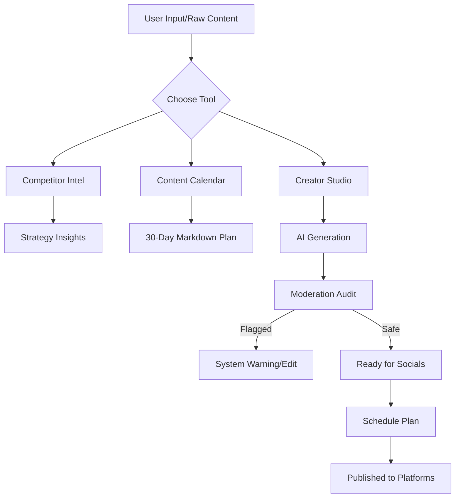
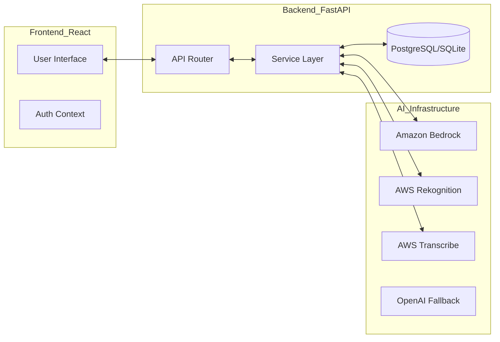

# Content Room 🎨: Empowering Creators for Bharat
**AI for Media, Content & Digital Experiences Track**

---

## 1) Brief about the Idea
**Content Room** is an all-in-one AI-powered orchestration platform designed specifically for the next generation of Indian content creators, small businesses (SMBs), and digital marketers. It transforms the chaotic process of content management into a streamlined, high-efficiency workflow. 

The core idea is to provide a "Virtual Studio" where a user can enter with a raw thought and emerge with a fully-moderated, platform-optimized, and scheduled multi-channel strategy. By integrating generation, safety auditing, and scheduling into a single pane of glass, it reduces the "tool fatigue" that hampers creator productivity.

---

## 2) How different is it from any of the other existing ideas?
While existing tools like Canva (design), Jasper (text), or Hootsuite (scheduling) exist in silos, **Content Room** creates a **Unified Content Lifecycle**:

*   **Integrated Moderation-First Approach:** Unlike most generators that ignore safety, our platform runs every piece of content through an AI safety audit (text/image/audio/video) *before* it's even saved.
*   **Tools** We offer key tools (Competitor Intel, Content Calendar) 
*   **Cultural Context (Bharat Focus):** Our Content Calendar isn't generic; it intelligently integrates Indian festivals, regional holidays, and niche-specific trends relevant to the Indian audience (e.g., Sustainable Fashion in the context of Diwali).
*   **Multi-Modal Intelligence:** It doesn't just do text. It analyzes images, transcribes audio, and audits video frames using advanced AWS computer vision.

---

## 3) How will it be able to solve the problem?
**The Problem:** Creators face three major hurdles: **Ideation Block**, **Safety Concerns** (avoiding flagged content), and **Platform Management**.

**The Content Room Solution:**
*   **Ideation Block:** Solved through the **Competitor Intel** engine that scrapes profiles to identify "Strategy Gaps" and the **Content Calendar** that plans 30 days of posts in seconds.
*   **Safety Concerns:** Solved by the **Moderation Engine**. It ensures that content complies with community guidelines across different media types, protecting the creator's reputation.
*   **Platform Management:** Solved by the **Schedule Plan** module which automates the publishing process to Twitter, Instagram, and LinkedIn.

---

## 4) USP of the Proposed Solution
1.  **Unified AI Pipeline:** One-click transition from Generation -> Moderation -> Scheduling.
2.  **Multimodal Safety Ledger:** The first creator tool to offer a unified "Safety Score" for combined text, audio, and visual assets.
3.  **Low Barrier of Entry:** Instant value via no-login tools, followed by deeper features for registered power users.
4.  **Hyper-Localization:** Content strategies that respect and leverage the Indian socio-cultural calendar.

---

## 5) List of Features (AWS Integration)
*   **🛡️ Multi-Modal Moderation (AWS Rekognition & Transcribe):**
    *   Image/Video frame analysis for unsafe content using **Amazon Rekognition**.
    *   Audio transcription and keyword safety auditing using **Amazon Transcribe**.
*   **🧠 Intelligent Strategy Engine (Amazon Bedrock):**
    *   Powering the Competitor Analysis and Content Gap Identification using **Anthropic Claude 3 / Meta Llama 3 on Bedrock**.
*   **🎭 Content Transformation (Amazon Bedrock):**
    *   Caption generation, tone-rewriting, and summarization.
*   **☁️ Scalable Media Storage (AWS S3):**
    *   Reliable storage for creator assets (images/videos) before they are published.
*   **🚀 Global Deployment (AWS Amplify & EC2):**
    *   Hosted on a robust AWS infrastructure for sub-second latency across India.

---

## 6) Process Flow Diagram

---

## 7) Architecture Diagram

---

## 8) Technologies Used
*   **Frontend:** React 18, TypeScript, Vite, TailwindCSS, shadcn/ui, Lucide Icons.
*   **Backend:** FastAPI (Python), SQLAlchemy (Async), Pydantic.
*   **AI Services:** Amazon Bedrock (Claude/Llama), AWS Rekognition, AWS Transcribe, OpenAI GPT-4o.
*   **Database:** PostgreSQL (Production) / SQLite (Dev).
*   **Integrations:** Social Media APIs/Cookies (Twitter, LinkedIn, Instagram).

---

## 9) Impact for Bharat (Hackathon Alignment)
*   **Digital Inclusion:** Empowers small town (Tier 2/3) creators by providing enterprise-grade AI tools for free/low cost.
*   **Safety & Compliance:** Helps Indian SMBs avoid legal/shadow-ban pitfalls by ensuring content moderation follows safety standards.
*   **Cultural Resonance:** The Indian Content Calendar feature ensures that "AI for Bharat" isn't just a label, but a functional tool that understands the pulse of the country’s festivals and events.
*   **Economic Opportunity:** Reduces the cost of specialized social media agencies for thousands of emerging digital entrepreneurs in India.
