# ContentOS: The AI-Powered Content Engine for Bharat 🇮🇳

## 🚀 The Big Idea
**ContentOS** is an intelligent, automated content workflow engine designed for India's next billion creators. It unifies content creation, moderation, translation, and distribution into a single, seamless platform.

We solve the "Content Chaos" by providing a workspace that doesn't just manage content—it *understands* it.

---

## 🛑 The Problem
1. **Language Barrier:** Most AI tools are English-first. Indian creators struggle to produce high-quality content in regional languages (Hindi, Tamil, Telugu, etc.).
2. **Safety & Moderation:** The Indian internet is exploding, but so is harmful content. Manual moderation is slow and expensive. Existing AI API solutions are costly and privacy-invasive.
3. **Fragmented Workflow:** Creators use 5 different tools (ChatGPT for writing, Canva for design, Google Translate, separate schedulers). This context switching kills productivity.

---

## 💡 The Solution: ContentOS
A unified **AI Native Operating System** for content.

*   **Create:** AI-assisted studio that generates captions, hashtags, and summaries.
*   **Moderate:** **Offline-first Deep Learning Moderation** that runs locally (zero API cost, privacy-first) to detect NSFW and Violence.
*   **Translate:** One-click translation into 8+ Indian languages using neural machine translation.
*   **Distribute:** Integrated scheduler for Twitter, Instagram, and LinkedIn.

---

## 🌟 Unique Selling Proposition (USP)
1.  **"Create in English, Reach in Bharat":** Write content in English and instantly deploy it in Hindi, Tamil, Telugu, Bengali, Kannada, Malayalam, Gujarati, and Odia.
2.  **Zero-Cost Deep Moderation:** Unlike competitors who rely on expensive APIs (AWS Rekognition, Google Vision), we implement a **custom deep learning ensemble (NudeNet + CLIP)** that runs *locally*. This makes ContentOS:
    *   **Free to run** (after initial setup)
    *   **Private** (data never leaves the server if needed)
    *   **Resilient** (works offline/low connectivity)
3.  **Unified Workflow:** We don't just stack features; we integrate them. A flagged post cannot be scheduled. A translated post retains the original's context.

---

## 🛠️ Tech Stack & Architecture

### Backend (Python/FastAPI)
*   **Framework:** FastAPI (High performance, Async)
*   **AI Services (Ensemble Architecture):**
    *   **LLM:** Groq (Llama 3), Gemini 2.0 Flash (Fallback)
    *   **Vision:** Custom Deep Learning Service (NudeNet for NSFW + CLIP for Semantic Violence detection)
    *   **Speech:** OpenAI Whisper (Local)
*   **Database:** SQLAlchemy (SQLite/PostgreSQL) with AsyncIO
*   **Validation:** Pydantic V2

### Frontend (React/TypeScript)
*   **Framework:** Vite + React 18
*   **UI Library:** TailwindCSS + Shadcn/UI (Beautiful, accessible, responsive)
*   **State Management:** React Context + Hooks
*   **Visuals:** Lucide React Icons, Framer Motion

### Architecture Diagram

---

## 🔄 Process Flow

The lifecycle of a content piece in ContentOS:

```mermaid
sequenceDiagram
    participant C as Creator
    participant S as Studio (AI)
    participant M as Moderator (AI)
    participant T as Translator
    participant Q as Scheduler
    
    C->>S: Input Idea / Draft
    S->>S: Generate Caption, Tags, Summary
    S-->>C: Review Content
    
    C->>M: Submit for Safety Check
    M->>M: Analyze (NudeNet + CLIP + Detoxify)
    
    alt Content Unsafe
        M-->>C: 🚩 Flagged (Violence/NSFW)
        C->>S: Edit Content
    else Content Safe
        M-->>C: ✅ Approved
        
        opt Localization
            C->>T: Request Hindi/Tamil Translation
            T-->>C: Translated Content
        end
        
        C->>Q: Schedule for Later
        Q-->>C: Confirmed
    end
```

---

## ✨ Key Features Matrix

| Feature | Description | Tech Powering It |
| :--- | :--- | :--- |
| **Smart Studio** | Generate viral captions, hashtags, and summaries instantly. | Llama 3 (via Groq) / Gemini 2.0 |
| **Deep Moderation** | Detect nudity, violence, gore, and toxicity without expensive APIs. | NudeNet (ResNet), CLIP (ViT), Detoxify (BERT) |
| **Bharat Translator** | Context-aware translation for Indian languages. | Google Translate API / Deep Translator |
| **Multi-Channel Scheduler** | Plan and post content to X, LinkedIn, and Instagram. | Social APIs |
| **Analytics Dashboard** | Track content performance and moderation stats. | Recharts, Aggregation logic |

---

## 🚀 Use Case Scenario

**Riya, a Content Creator from Jaipur:**
1.  **Drafts:** Riya types a post concept in restricted English.
2.  **Enhance:** ContentOS rewrites it into a professional LinkedIn post using the **Studio**.
3.  **Localize:** She hits "Translate to Hindi" to widen her reach to her local network.
4.  **Safety:** She uploads an image. **Deep Moderation** instantly checks it. It flags a background poster as "suggestive".
5.  **Fix:** Riya blurs the background. The system approves it (Safety Score: 98%).
6.  **Schedule:** She sets it to post at 10 AM tomorrow.
7.  **Result:** Riya saves 2 hours and reaches 2x audience.

---

## 🏆 Innovation & Hackathon Alignment
**Why ContentOS fits "AI for Bharat":**
*   **Empowers Regional Creators:** Breaks the language barrier.
*   **Promotes Safe Internet:** Proactive, privacy-preserving moderation prevents hate and abuse.
*   **Resource Efficient:** Optimized to run on standard hardware (using quantized models and efficient architectures like EfficientNet/ViT), making it accessible for startups and SMEs in India.
